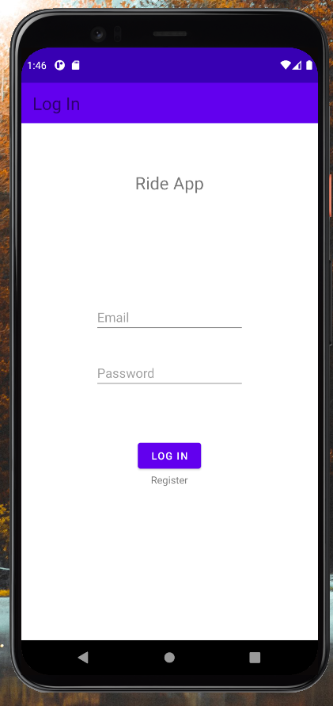
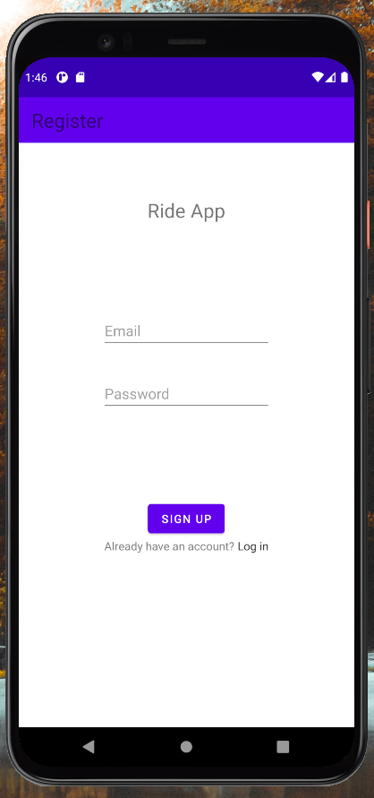
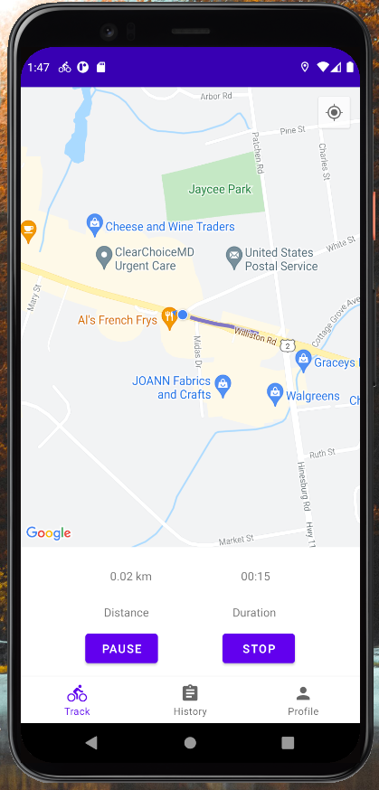
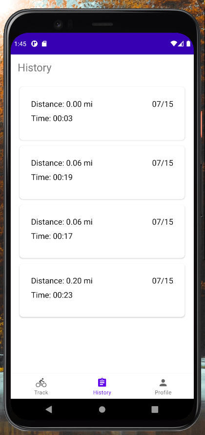
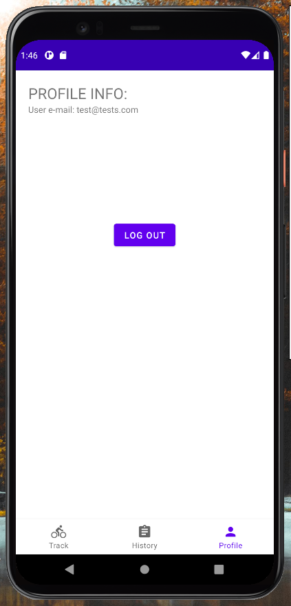

# Android Mobile App: Bike Ride Tracker 

## Description :

This app was built using Kotlin and the Google Maps SDK for android. 
The backend is handled using Google's Firebase for both authentication and database.
In this app, the user is able to authenticate and store bike rides recorded by the app.

## Architecture: 

To the best of my knowledge, this application was made following a simplified version of the MVVM architecture:

### Diagram:

### **View** 
`'LoginActivity'` is the main activity and hosts the login and register fragments that represent those actions by the user. 

`'HomeActivity'` is the second and last activity where the user can access the map, ride history, and profile settings (log out, delete account).

`'HistoryFragment'` holds a recyclerview with the list of rides by the user received from the realtime database. Users may also remove rides from this fragment. 

`'MapsFragment'` holds a Google Map that shows the user their location and tracks the bike ride with Polylines. Of course, buttons to start, pause, resume, or stop the service. 

### **ViewModel**

Each view model implements properties which the views bind to and react to when there are updates. Therefore, the view model drives the functionaliy of the UI. This is accomplished through LiveData and one way data binding. Simpler views like the login and register fragments use view binding instead.  

### **Model**
The model package contains a data model `Ride`, representing an user recorded bike ride that consists of the ride's time, distance, and date.

### Repository 
The repository package has authentication and database repositories. The goal of the repository is to serve as data access, the view models then show only what the view needs through LiveData transformations. 

## Screenshots

#### Login, Register Screen:

 
 

#### Map, History, Profile Screens:

